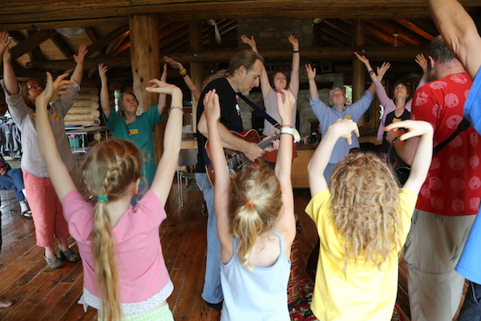
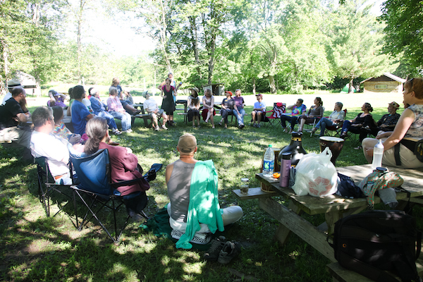
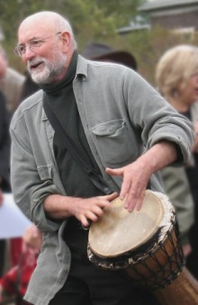
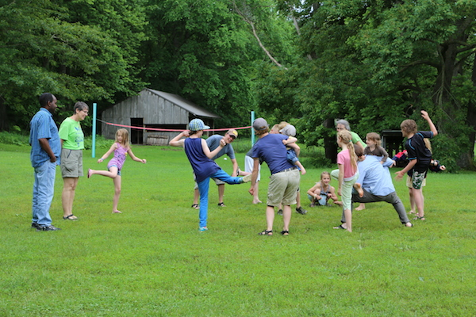
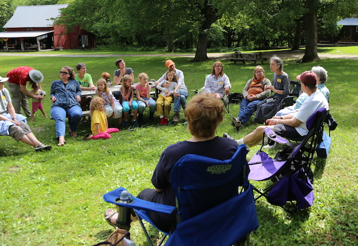
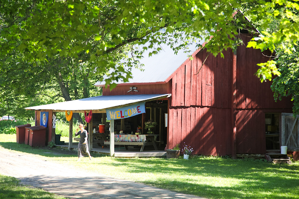
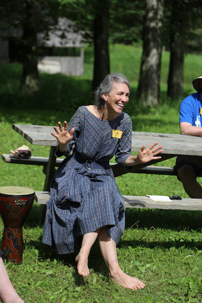

<blockquote>
Words and music need only breath and spirit to live. --Pete Seeger
</blockquote>

Do you long to twine your voice with others in song? Do you love to be outside
among trees, water, and sky?  Do you know the pleasure of gathering with
people of all ages? 

Come join the growing global community movement that is knitting the world
together through songs of love, play, spirit, and freedom. Nestle into a
beautiful setting amongst the ancient bluffs of the Driftless, where a creek
runs through the center and we eat real food made with soul. Play, sing,
dance, and rest your bones by the fire. 

We’ll sing songs to gather people and explore the ways we can use singing to
deepen our sense of communion with each other and our sacred respect and
wonder in the face of all nature. We’ll sing easy-to-learn, playfully
challenging songs that speak to critical themes—environmental, social,
interpersonal—in a way that brings joy, a sense of success, and an expression
of shared meaning.  

Learn with songleaders whose love for group singing inspires us all. Relax
into the voice you were born to sing with as we share beautiful, fun, simple
songs that can reshape our world. 

<blockquote>
We are the gift between earth and heaven 
We are the song between sky and ground 
Sing for your life and for this world we’re making 
Nothing is lost that can’t be found
</blockquote>

## The music

How do we go beyond sustainability and learn to thrive again? How do we
entertain, inspire, create? How do we make connection with each other without
elaborate technology, using simply the inner resources we were born with?

We raise our voices together in songs that celebrate love, diversity, power,
the rhythms of the year, and the circle of life. We sing songs for times when
comfort is needed, and songs that remind us of our ancestors. We sing songs to
give us courage in our work to re-wild the world. We sing songs from home and
songs from afar. We sing silly songs and songs that invite dancing, songs that
you can take home and sing the rest of your life.  By the circular,
non-hierarchical, harmonious intertwining of our voices we bring light to the
world.

## Our Songleaders

Experienced and dedicated songleaders bring gems from their own living
communities to teach to us. Opportunities abound for other emerging
songleaders as well, as all are welcomed to share the songs of their
communities. In the spirit of bringing more singing into every nook and cranny
of our country, a group discussion will be held to exchange ideas about
community songleading for our times. 

Songleaders include [Barbara McAfee](http://barbaramcafee.com), Francis Gurtz
and Colette Miller, Ellen Rockne, and Liz Rog. More songleaders will be
announced in the weeks to come.

Very Special 2014 Guest Laurence Cole  comes from Port Townsend, Washington to
share with us his wonderful songs and powerful leadership. Laurence brings a
wealth of experience and inspiration to his songleading, borne of his 70+
years of music making. Village Fire 2014 will feature many of his songs, and
his presence will make this an unforgettable year. 

Laurence says we're…

##### Singing Together to Nourish the Soul and Re-enchant the world with song…

<blockquote class="textquote">
“Part of my mission is to re-acquaint people with their birthright and natural
ability to make beautiful and meaningful sound together. Most of the songs
I’ve written are short, easy to learn, chant-like songs with several layers
that fit over and around each other in interesting and pleasurable rhythmic
and harmonic challenges that make them fun to sing. Group singing is one of
the most ancient and primal ‘technologies of belonging’ that we humans have
been using since our earliest times, possibly before speech itself. When we
make joyous and passionate song together, it nourishes our souls and offers an
enlivening gift back to the natural world that made us and gives us our
sustenance and our very being. When such an exchange is genuinely made, and
the song finds its natural ending, often there is a sweet, lively silence in
which we simply stand and hold the ‘enchantment,’ the sense of deep and
genuine communion.”
</blockquote>

## The Schedule (more details to come)

**Thursday, May 29** 

* Greeters at the Welcome Table will be watching for you between 2 p.m. and 5
  p.m. They will help you find your way around and begin meeting others at our
  gathering. You may arrive anytime all day, even at 8a.m. 
* At 5 p.m. gather for Opening Circle and Celebration of What’s to Come.
* Our first shared meal is a Thursday evening potluck at 6 p.m. 
* At night we’ll gather around the fire for open song sharing. 

**Friday, May 30 and Saturday, May 31** 

* Three great meals served at 8am, noon, and 5pm. Bring snacks for
  between-times. 
* During the daytimes our songleaders offer a variety of themed song sessions,
  from relaxed to rousing. Every song is accessible and taught to all, mostly
  by ear. 
* Children’s activities are offered off and on during the day.
* Games, creek play, and more…
* By the evening fires we gather again to share still more songs, taking turns
  among any who have a song to lead or suggest. Be you a learner or a leader,
  you are warmly welcomed.

**Friday night Special**

Come dance with friends new and old! Decorah’s own Erik Sessions, John Goodin,
and Lucas Blekeberg will play their fiddle, guitar, and mandolin for a good
old-fashioned contradance, called by Bill Deutsch. 

**Sunday, June 1**

* Breakfast and lunch served, Song Circles in the morning, and closing circle
  at 2 p.m. We really hope you’ll be able to stay through the closing circle,
  which is always quite lovely. 

## What Else?

Time for walking around in the woods. Time to play games and run around. Time
to meet new friends. Time to sit around the campfire. Time to go wading in the
creek. Time to stretch or practice yoga. Time to tell stories and jokes. Time
to eat slow meals. Time to relax. Time to re-create our world in love and joy. 

## Who is Invited?   

Everyone is welcome. No singing background is necessary whatsoever. We will be
a mix of experienced singers and new singers, and you won't believe how great
we'll sound together. We will be a mix of city and rural people, and we will
love getting to know each other. We will be a combination of many backgrounds,
and we will be glad for it all. We will be a mix of old, young, and in-between
people, befriending each other through the play of song. 

## The Setting  

Camp Tahigwa in Northeast Iowa is an old camp on 300 acres of expansive hills,
hardwood forests, limestone cliffs, caves, and a meandering trout stream. From
the moment we arrive we will begin to create the community we love, welcoming
each other and opening our circles to include all. We will make a home there
and work together to care for the land, water, creatures, and people of our
community.  [Click here for a map.](https://goo.gl/maps/9v8wp)

## Lodging

There are many options, at various levels of rusticity. All are available on the
same sliding fee scale. You are welcome to reserve spaces with friends and
family.

* Camp in your tent either right near to base camp or down the path in a more
  secluded area. 
* Stay at ‘Polly’s Place’, a group of 4 cabins with 8 bunks each. 2 cabins for
  women, 1 for men, one mixed. This is about a 5 minute walk from base camp.
  Fire circle, electricity, no kitchen, shower house and toilets.
* Stay right at the ‘Main Lodge’, in the same building as the kitchen, where
  there are 30 beds. Upstairs women, Downstairs men. 
* Stay at the ‘Staff House’ (no staff there while we're at camp) where there
  are 10 double futons downstairs. There are indoor toilets and showers and a
  small kitchen, and electricity.  Men and women mixed.
* Stay in the ‘Tree Houses’ (wooden houses on stilts) about 15 minutes walk
  from base camp. There are 9 of them, each sleeping 4 people.  Bathrooms,
  showers, electricity, fire circle.  Men and Women mixed.

## Accessibilty   

Base camp is fully accessible. We will work with you to be sure your needs are
met; please help us do so by sharing your needs in advance.

## Food  

Tasty whole food meals will be provided by friend of Village Fire Ruth
Hampton. (More about Ruth at
[troutrivercatering.com](http://troutrivercatering.com) and 
[awesomecookery.com](http://awesomecookery.com)) Ruth will prepare 8 meals, Friday breakfast through
Sunday lunch, for up to 150 people. All meals will be vegetarian, with options
that are dairy free and gluten free.  More info about the menu will be
available by April 15. 

**If you would like to eat the food prepared at camp, you need to register by
May 18.** 

If you prefer, you are also welcome to bring food and a campstove and make
your own food. 

Ruthie is keeping the cost of our meals low by inviting our help in the
kitchen, and so we’ll be looking for some people to spend one meal helping.
This will add to the fun! 

## Cost

We offer a sliding scale, knowing that all will pay as they are able and thus
help our event sustain itself.

* Adults, with meals: $80 - $160
* Kids 11 and under, with meals: $40 - $80
* Adults, bringing your own food: $50 - $100
* Kids 11 and under, bringing your own food: $25 - $50

## How Our Schedule Works

Upon our arrival we create a plan for song circles according to the desires
and skills of those present on any given day. In this way we are able to
schedule just the right number and type of circles for the number and
interests of those present. This is a transformational method of
self-organizing sometimes known as Open Space Technology, and our use of it
brings forth the best of our skills and passions. You’ll be glad to be part of
this way. 

Some themes and specialties of last year’s regional songleaders included:

* *Songs for Ritual and Celebration.* These are simple songs you'll be able to
  pull out of your memory when it's time to mark life's beginnings, endings,
  birthdays, homecomings, the turning of the seasons, and more.
* *Songs for Kids and Those Who Love Them.* Early American dancing games, silly
  songs, and songs that celebrate the beauty of our diverse world. 
* *Singing for Rowdies and Rascals—with a Brief Foray into Kumbaya* 
* *Dances of Universal Peace.* The Dances of Universal Peace are spiritual
  practice in motion. Drawing on the sacred phrases, scripture, and poetry of
  the many spiritual traditions of the earth, the Dances blend chant, live
  music and evocative movement into a living experience of unity, peace and
  integration
* *Songs of the annual gathering 'Singing Alive!'* Birthed in the bosom of the
  Pacific NW eco-festivals. This event is about bringing people together who
  feel called to awaken, and nurture their spiritual life through communion
  with songs, prayers, chants, and blessings, of celebration of life in this
  temple universe. 
* *Civil Rights and Movement Songs.* A singing movement is a winning movement,
  and there are lots of great peoples songs from struggles for liberation
  around the world. Both familiar and new, both old and recent.
* *Songs of Comfort and Healing* for those struggling with living or dying. The
  spirit of the music ranges from gentle and soothing to uplifting and lively.
  Though they hold this work sacred, they do not adhere to a particular
  religious tradition.
* *Group Improvisational Singing and Chanting*
* *Drumming and Dancing*
* *Songs from Other Lands and Times*
* *Simple Four-Part Beauties* that Sound Like the Mormon Tabernacle Choir! Layer
  songs, spirituals, and sacred songs from world traditions.
* *Songs Pete Seeger Taught Us.* In honor of one of our most beloved American
  heroes! 

## Can you help with any of these tasks?

Help for a few hours or more, as you are able, with:    

* Leading morning stretching or yoga sessions
* Leading non-competitive group games
* Creating a plan for the children’s area or contributing an idea for a
  project or activity at the children’s area
* Coordinating volunteers 
* Tending the Welcome Table 
* Tending the Coffee/tea station
* If you have experience with Theatre of the Oppressed, we want to talk to you
  about ideas for your presence at Village Fire. 
* Are you a drummer? Come ready to use what you’ve got! 

## We Want to Hear Your Ideas

On the <a href="http://www.eventbrite.com/event?eid=10717304747">Registration
Form</a> you can tell us more about your own thoughts and ideas for Village
Fire as well as any special needs you might have.

For questions and comments before and after you register, please contact Liz
Rog at <a href="mailto:liz@decorahnow.com">liz@decorahnow.com</a> or
563-382-8013.

Come let us wrap ourselves in all of these things.

