####  Singing Together to Nourish the Soul  and Re-enchant the World with Song

Do you long to twine your voice with others in song? Do you love to be outside
among plants, trees, creatures, water, and sky? Do you know the pleasure of
gathering with people of all ages, each bringing their gifts and passions to
share?

Come join the growing global community movement that is knitting the world
together through songs of love, play, spirit, and freedom. Nestle into a
beautiful setting amongst the ancient bluffs of the Driftless, where we eat
real food made with soul, and a living creek winds through it all. Play, sing,
dance, and rest your bones by the fire.

At camp there is spaciousness of time. Time for walking around in the woods.
Time to play games and run. Time to meet new friends and really listen. Time
to sit around the campfire. Time to wade in the creek. Time for movement
practice. Time to tell stories and jokes. Time to eat slow meals. Time to
relax. Time to lean into the world.

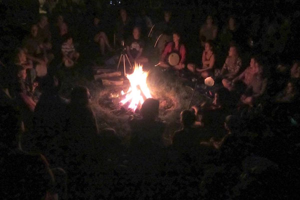

## Who Will Be There

Everyone is welcome. No singing background is necessary whatsoever. We will be
a mix of experienced singers and new singers, and you won’t believe how great
we’ll sound together. We will be a mix of city and rural people, and we will
love getting to know each other. We will be a combination of many backgrounds,
and we will be glad for it all. We will be a mix of old, young, and in-between
people, befriending each other through the play of song.

### We Love Children!

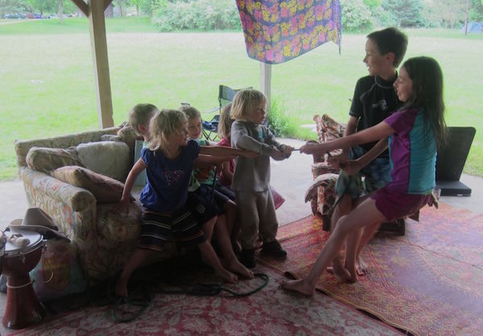

Children are welcome everywhere at Village Fire. There is also a KiD’s TeNt
where special activities are planned: crafts, games, songs, and more. If you’d
like to help out at the Kid’s Tent, let us know! Whether you are a parent of
young children or not, you are welcome to be part of their fun. We are a
village.
  

## What We Do

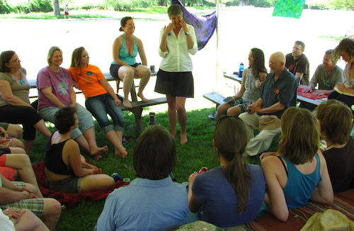
We explore the ways that singing can deepen our sense of communion with each
other and our sacred respect and wonder in the face of all nature. We sing
easy-to-learn, playfully challenging songs that speak to critical
themes—environmental, social, interpersonal—in a way that brings joy, a sense
of success, and an expression of shared meaning. 

Our days flow between small circles of song led by both experienced and
emerging songleaders; mealtimes shared at picnic tables and on the grass;
evening time programs of dance, variety shows, and other fun; late-night
singing around the campfire, taking turns between all who wish to invite a
song; and heavenly sleep to renew it all. We hold it all together with our
rituals of opening, closing, blessings before meals, deep honoring of the
earth and sky that hold us, and tending to the grief that is part of being
alive in this beautiful and aching world. 

Come learn with songleaders whose love for group singing inspires us all.
Gather songs and ideas to take home and help renew community. Relax into the
voice you were born to sing with as we share beautiful, fun, simple songs that
help re-enchant our world.

<blockquote>
We are the kiss between earth and heaven 
We are the song between sky and ground 
Sing for your life and for the world we’re making 
Nothing is lost that can’t be found 
&nbsp;&nbsp;--Gerri Ravyn Stanfield
</blockquote>

## Our music

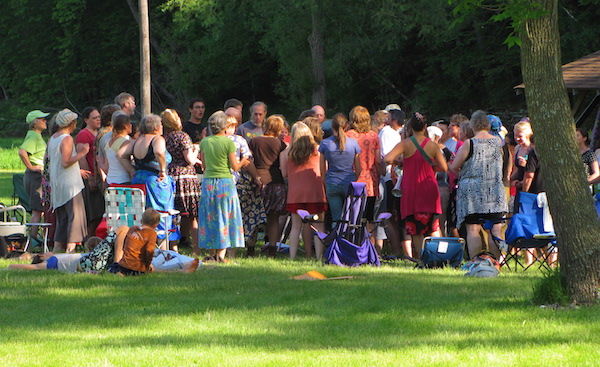
How do we go beyond sustainability and learn to thrive again? How do we
entertain, inspire, and create? How do we make connection with each other
without elaborate technology, using simply the inner resources we were born
with?

We raise our voices together in songs that celebrate love, diversity, power,
the rhythms of the year, and the circle of life. We sing songs for times when
comfort is needed, and songs that remind us of our ancestors. We sing songs to
give us courage in our work to re-wild the world. We sing songs from home and
songs from afar. We sing silly songs and songs that invite dancing, songs that
we can take home and sing the rest of our lives. By the circular,
non-hierarchical, harmonious intertwining of our voices we bring light to the
world.

## Our Songleaders

Experienced and dedicated songleaders bring gems from their own living
communities to teach to us. Also, opportunities for emerging songleaders
abound, as all are welcomed to share songs. Because we seek to bring these
healing ways of singing and being into every corner of our country, we gather
for group discussion about community songleading for our times.

Very special 2015 guest Laurence Cole comes from Port Townsend, Washington to
share with us his wonderful songs and powerful leadership. Laurence brings a
wealth of experience and inspiration to his songleading, born of his 70+
years of music making. Village Fire 2015 will feature many of his songs, and
you will want to take them home with you to spread and spread. 

Here's what Laurence has to say about these singing ways. 

<blockquote class="textquote">
“Part of my mission is to re-acquaint people with their birthright and natural
ability to make beautiful and meaningful sound together. Most of the songs
I’ve written are short, easy to learn, chant-like songs with several layers
that fit over and around each other in interesting and pleasurable rhythmic
and harmonic challenges that make them fun to sing. Group singing is one of
the most ancient and primal ‘technologies of belonging’ that we humans have
been using since our earliest times, possibly before speech itself. When we
make joyous and passionate song together, it nourishes our souls and offers an
enlivening gift back to the natural world that made us and gives us our
sustenance and our very being. When such an exchange is genuinely made, and
the song finds its natural ending, often there is a sweet, lively silence in
which we simply stand and hold the ‘enchantment,’ the sense of deep and
genuine communion.”
</blockquote>

### More Village Fire 2015 Songleaders

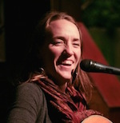 
**Aimée Ringle** is a singer/songwriter, songleader and
multi-instrumentalist. For 20 years Aimée has written, sung and played in
living rooms, coffee shops and around campfires from Arizona to Iowa to
Scotland. She has performed and led song circles along the West Coast at
festivals and gatherings like <a href="http://singingalive.org">Singing
Alive</a>! and is part of Songweavers with Laurence Cole and Aimée Kelley.
This spring she started a chorus for girls ages 10-13, which is going and
growing strong! She lives and works in Port Townsend but a part of her heart
will always beat and sing in Decorah, Iowa. You can check out her original
music at <a href="http://www.aimeeringle.com">www.aimeeringle.com</a>
  

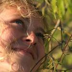
**Ida Rotto** is a young and enthusiastic song leader from the Driftless
bioregion of Northeast Iowa. She comes to Village Fire to breathe the air of
home, drink up the new and familiar voices and songs, and share the songs of
her travels. She is on the mission to raise community singing out of its sleep
and let the wild human medicine of song weave through the everyday air! She
brings story songs and silly songs, songs of this new and changing time and
songs from the time of ancestors, songs that are easy to learn and make
beautiful. She believes that singing is essential as we find our wild place in
the hum of nature.  

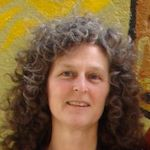
**Lia Falls** is a mom, a singer, a teacher and a songwriter. She teaches
Vocal Playground/Yoga of the Voice classes (Yoga of the Voice as developed by
Silvia Nakkach and the Vox Mundi Project) in Minnesota and Wisconsin and leads
regular community song circles. Coming from the heart of an explorer,
listening, curiosity, and devotion are her guiding principles. Believing that
there is no such thing as a person who can’t sing, Lia is devoted to creating
a safe place for people to use their voices.
 

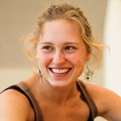 **Sophia Rog**  is a dance
artist, bodyworker, and song leader. She carries song with gratitude 
for the childhood of music that instilled in her the knowing that
song can be as necessary and easeful as breathing, walking, and doing the
dishes. Currently residing in Santa Fe, NM, she performs, teaches Contact
Improvisation, works as a massage therapist, and sips on the wide-sky lessons
the desert has to teach her.  Sophia brings to VF a deep-running passion for
embodied awareness and agency, a smattering of delightful songs from her
song-sharing and learning in NM, and a readiness to research integration of
her movement knowledge with the song-circle tradition which she finds herself
gratefully inhabiting. The Driftless region of Northeast Iowa is the land to
which she most deeply belongs, and she returns here in utter joy.
 

 **Colette
Miller** and **Francis Gurtz**, life partners since 1985, have a shared
interest in Dances of Universal Peace, Early American shape note singing,
drumming, and silent worship with Friends at Quaker Meeting. They also co-lead
a hospice choir in Rochester, bringing song twice a month to those at the end
of life. They especially enjoy music that is participatory. They love the
laughter, the tears, and the community built with song - which often speaks
where words fail.  
 

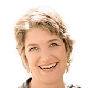 
**Barbara McAfee** is a native Minnesotan, a singer/songwriter with seven CDs,
founder of the Morning Star Singers (Comfort Choir), voice coach, author of
Full Voice: The Art and Practice of Vocal Presence, and a relentless community
song leader. She can’t quite believe she gets to do all of this...and is
grateful.  <a href="http://www.barabaramcafee.com">www.barbaramcafee.com</a>
 

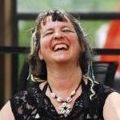
**Tanna Worrell**  has shared her talent and love for hand drumming in many
ways, for many years – in a multi-cultural dance and drum troupe, women’s
groups, healing groups and community drum circles. Tanna knows that the
physical act of drumming-in-a-group-together evokes all manner of happiness,
connection, and Setting Things Right in the World. 
 

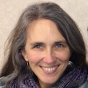
**Liz Rog** lives to twine her voice with those of others in the Driftless and
beyond. She leads a variety of community singing groups in Decorah, IA and
loves Village Fire because of the cross-pollination of voices and ideas among
so many grassroots movers and shakers. She lives near Decorah at Fern Hollow,
next door to the <a href="http://fernhollowcabin.com">home of her ancestors</a>.
 

## The Shape of Our Days
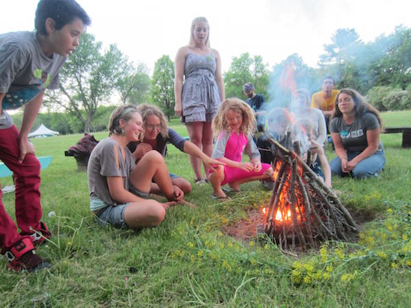

**Wednesday, June 10**

* Greeters at the Welcome Table will be watching for you between 3 p.m. and 6
  p.m. They will help you find your way around and to begin meeting others at
  our gathering.
* Our first shared meal is Wednesday evening at 6 p.m.
* At night we’ll gather around the fire for open song sharing and perhaps some
  other special happening.

On Thursday at 10:30 am we come together for our Village Fire
Opening Circle. Come join in this joyful calling out of our 
gratitudes and blessings on our gathering grounds.

**Thursday, June 11, Friday, June 12 and Saturday, June 13**

* Wholesome meals are served at 8am, noon, and 5pm. At the snack table you can
  find whole food treats for in-between meals; feel free to bring some more to
  share!
* Morning Circle begins each day at 9:00. This is where we launch our day
  together, first through movement, singing, or playing, and then though
  announcement of the needs and plans for the day. At morning circle we ground
  and connect. Then we step forth into the day of possibilities.
* During the daytimes our songleaders offer a variety of themed song sessions,
  from relaxed to rousing. Every song is accessible and taught to all.
* Children’s activities are offered during part of the day.
* Each day we hold space open for small groups to gather during *Community
  Offerings*. This is a time when you might offer to show or lead something you
  love to do in your community. At morning circle you’ll have a chance to
  announce your Community Offering or learn what others might be offering.
  Last year these sessions included Laughter Yoga, Thai Chi, nature walks, a
  singing bowl demonstration, conversation about Community Rights work, and
  more.
* The days are sprinkled with games, creek play, and other spontaneous
  eruptions of both interbeing and quiet time. 
* By the evening fires we gather again to share still more songs, taking turns
  among any who have a song to lead or suggest. Be you a learner or a leader,
  you are welcomed to follow the pull of your heart.

<b>Special Evening Happenings</b>

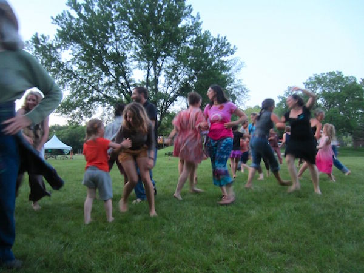
Most nights after dinner and before the lighting of the fire for nighttime
singing, we gather for some special event.

On Friday night there’s an old-time dance in the open field with Decorah’s own
Erik Sessions, John Goodin, and Lucas Blekeberg on their fiddle, guitar, and
mandolin and Bill Deutsch calling the dances. No experience needed! 

On one of the other nights we’ll make space for our wonderful variety show.
Maybe you’d like to play a tune, recite a poem, or sing a song for us. You
might work something up with a new Village Fire friend. The sky’s the
limit—last year we got an acro-yoga demonstration from Lyndsey and Rose! The
variety show is another way in which we say YES to each other’s voices and
gifts and YES to shared joy.

**Sunday, June 14**

* We’ll share breakfast together, hold morning song circles, eat lunch, and
  gather for closing circle at 2 p.m. We really hope you can stay for closing
  circle, as it makes our goodbyes more beautiful and more bearable. By 3:00
  or so we’ll be ready for all the hands that can stay for cleanup.

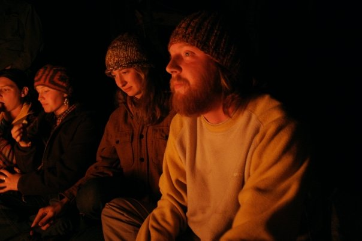

## Our Camp

Camp Tahigwa in Northeast Iowa is an old camp on 300 acres of expansive hills,
hardwood forests, limestone cliffs, caves, and a meandering trout stream. From
the moment we arrive we will begin to create the community we love, welcoming
each other and opening our circles to include all. We will make a home there
and work together to care for the land, water, creatures, and people of our
community.

###  Directions

The address is [Camp Tahigwa, 318 Tahigwa Dr, Dorchester, IA
52140](https://goo.gl/maps/9v8wp). *Your GPS will not work in the winding
valleys of NE Iowa, so be sure to come prepared with directions*. We’ll have
signs at some of the important intersections close to camp. Here are
directions

* If you are coming from the Northwest via Rochester, MN:
  [DirectionsfromNorthwestRochesterMN.pdf](images/DirectionsfromNorthwestRochesterMN.pdf)
* If you are coming from the Northeast via LaCrosse, WI:
  [DirectionsfromNortheastLaCrosseWI.pdf](images/DirectionsfromNortheastLaCrosseWI.pdf)
* If you are coming from the Southwest via Decorah, IA:
  [DirectionsfromSouthwestDecorahIA.pdf](images/DirectionsfromSouthwestDecorahIA.pdf)
* If you are coming from the Northwest via Rochester, MN:
  [DirectionsfromSouthwestWaukonIA.pdf](images/DirectionsfromSouthwestWaukonIA.pdf)

## Lodging

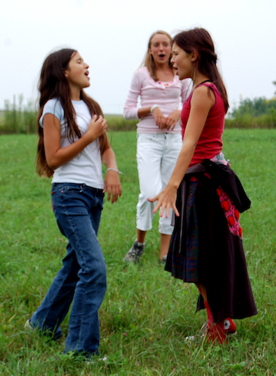
There are many options, at various levels of rusticity. All are available on the
same sliding fee scale. You are welcome to reserve spaces with friends and
family.

* Camp in your tent, either right near to base camp or down the path in a more
  secluded area.
* Stay at ‘Polly’s Place’, a group of 4 cabins with 8 bunks each. 2 cabins for
  women, 1 for men, one mixed. This is about a 5 minute walk from base camp.
  Fire circle, electricity, no kitchen, shower house and toilets.
* Sleep on a cot at the ‘Main Lodge’, in the same building as the kitchen, where
  there are 30 beds. Upstairs women, Downstairs men. Shower available in the
  main bathrooms. 
* Stay at the ‘Staff House’ (no staff there while we're at camp) where there
  are 10 double futons downstairs. There are indoor toilets and showers and a
  small kitchen, and electricity.  Men and women mixed.
* Take a cot in one of the six Platform Tents. They sit on wooden bases and
  have 6 cots each with foam mattresses. They sit 2 minutes’ walk from base
  camp. No electricity. Bathrooms and showers are right nearby. 

  
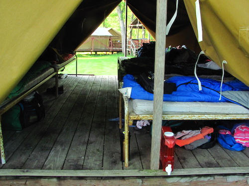

## Accessibility  

Base camp is fully accessible. We will work with you to be sure your needs are
met; please help us do so by sharing your needs in advance.

## Herbal Wellness Tent

Together we will create a peaceful, supportive and inviting space to take care
of health & wellness concerns that may arise during Village Fire. It will
include a massage table, herbal remedies such as tinctures & salves and
various helpful first aid items. There will be "open hours" when a volunteer
herbalist will staff the space if questions arise. People who want to use the
space for healing such as massage or energy work can sign-up for private use.
This space will not replace prompt emergency health care. 

Wish List: (Contact Jess to discuss)

1. Herbal remedies and products. Tinctures, dry herbs, salves, bug spray... They must be labeled clearly with all ingredients.
2. First aid supplies like gauze, tape, bandaids and washcloths.
3. Items to make the space comfortable and pleasing like blankets & pillows. Sacred items like crystals, rocks and shells would be good too.

If you are an herbalist and would like to help facilitate this endeavor or if you are a student of the plants and are looking to gain experience there may be mentorship and learning opportunities.

Please contact Jess Krueger <a href="redcloverbirth@gmail.com">redcloverbirth@gmail.com</a>.

## Food 

Friend of Village Fire Ruth Hampton will once again make us tasty whole food
meals. (More about Ruth at
[troutrivercatering.com](http://troutrivercatering.com) and
[awesomecookery.com](http://awesomecookery.com)). All meals will be vegetarian,
with options that are dairy free and gluten free.  Click here to see the
entire [menu](images/menu.pdf). Wednesday’s first meal is supper. On Thursday, Friday, and
Saturday, Ruthie will make three meals for us. On Sunday the last meal will be
lunch.

If you prefer, you are welcome to bring food and a camp stove to make
your own food. Though there is a home-sized refrigerator at the staff house,
we recommend that if you need cold storage you bring a cooler.

Helping out in Ruthie’s kitchen is fun, and you’ll have a chance to put in a
shift there if you’d like.

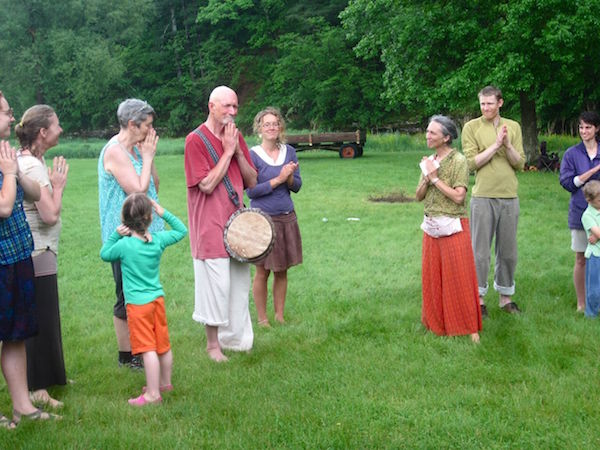

## Cost

We offer a sliding scale, knowing that all will pay as they are able and thus
help our event sustain itself. Most of your money goes toward food and Camp
Tahigwa. Since last year’s Village Fire we’ve added a 5th day; therefore these
scales reflect 3 additional meals.

The choices below can be a little confusing. Why do we do it this way? It’s
because we really want money to not stand in the way of your coming, and
because we need those who have more money to help out a little more. Thank you
for taking the time to figure out what you can do.

* Adults, with meals: $90 - $220
* Teens 12 - 18, with meals: $65 - $100 
* Kids 11 and under, with meals: $45 - $90

* Adults, bringing your own food: $50 - $100
* Teens 12 - 18, bringing your own food: $25 - $50 
* Kids 11 and under, bringing your own food: $25 - $50

By the Day

* With meals, adult $30/day, teen/child $15/day
* Bringing your own food, adult $15/day, teen/child free

## How Our Schedule Works

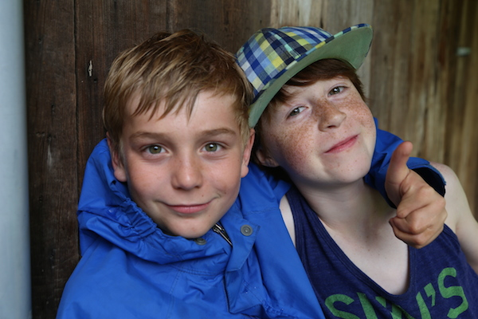
Upon our arrival we create a plan for song circles according to the desires
and skills of those present. In this way we are poised to take advantage of
the surprising gifts that show up, and we are able to schedule just the right
number and type of circles for the number and interests of those present. This
is a transformational method of self-organizing sometimes known as Open Space
Technology, and our use of it brings forth the best of our skills and
passions.

Some themes and specialties of last year’s regional songleaders included:

Some Village Fire themes from other years have included:

* *Songs for Ritual and Celebration.* These are simple songs you’ll be able to
  pull out of your memory when it’s time to mark life’s beginnings, endings,
  birthdays, homecomings, the turning of the seasons, and more.
* *Songs for Kids and Those Who Love Them.* Early American dancing games, silly
  songs, and songs that celebrate the beauty of our diverse world.
* *Singing for Rowdies and Rascals—with a Brief Foray into Kumbaya*
* *Dances of Universal Peace.* The Dances of Universal Peace are spiritual
  practice in motion. Drawing on the sacred phrases, scripture, and poetry of
  the many spiritual traditions of the earth, the Dances blend chant, live music
  and evocative movement into a living experience of unity, peace and integration.
* *Songs of the annual gathering ‘Singing Alive!’* Birthed in the bosom of the
  Pacific NW eco-festivals. This event is about bringing people together who
  feel called to awaken, and nurture their spiritual life through communion with
  songs, prayers, chants, and blessings, of celebration of life in this temple
  universe.
* *Songs that Empower Activism.* A singing movement is a winning movement, and
  there are lots of great people's songs from struggles for liberation around the
  world. 
* *Songs of Comfort and Healing* for those struggling with living or dying. The
  spirit of the music ranges from gentle and soothing to uplifting and lively.
  Though they hold this work sacred, they do not adhere to a particular
  religious tradition.
* *Group Improvisational Singing and Chanting*
* *Drumming and Dancing*
* *Songs from Other Lands and Times*
* *Simple Four-Part Beauties*

A Few New Dreams for 2015! 

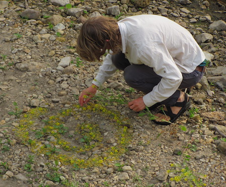
(We can’t yet know whether all of these will happen this year...if you feel
called to help with any of these, let us know)

* A song circle for emerging songleaders, taking turns practicing leadership
* More children’s song circles, both for the wee ones and for the older kids
* Making ever more ways for our teens to feel safe and to shine
* More movement and drumming: drumming and dancing, contact improvisation, and
  other ways of embodiment
* More opportunities to participate in woods walks, foraging, birding, and star
  gazing
* Collaborative song-making
* Grief-tending ritual
* Council Practice, to learn deep listening skills for strengthening our
  families and communities
* Making art together
* A ‘Learning Village’ where we can practice using new technologies such as
  rocket stoves and solar ovens
* Herbal First-aid tent, for healing, quiet, and rejuvenation

## We Pitch In to Make it Work

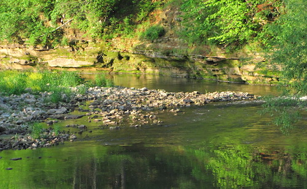
When you arrive at our camp’s welcome table, you’ll have a chance to sign up
to help with a few 1 or 2-hour shifts. Here are some of the things that will
need your help:

* Camp set-up: could you come 1 or 2 days early to help? 
* Tending the Welcome Table (this year it will be right next to the shelter, so
  you’ll be right next to the action). 
* Helping Ruthie get meals on the table
* Setting up the dishwashing station 
* Tending the Coffee/tea and snack station
* Leading stretching or yoga sessions
* Leading non-competitive group games
* Hanging out with kids at the children’s area

## We Want to Hear Your Ideas

On the <a href="http://villagefiresinging.eventbrite.com">online registration
form</a> you can tell us more about your own thoughts and ideas for Village
Fire as well as any special needs you might have.

<a name="what_to_bring" href="images/BringtoVillageFire.pdf">Click here</a> for a list of
things you might want to bring to Village Fire.

Contact Us: 

* General Questions: Liz Rog, <a href="mailto:liz@decorahnow.com">liz@decorahnow.com</a> or 563-382-8013.
* Registration Questions: Brenna Everson, <a
href="mailto:Villagefiresinging@gmail.com">Villagefiresinging@gmail.com</a> or
701-739-9001.  
* <a href="http://eepurl.com/uFbKr">Click here</a> to sign up for email updates about other regional singing events.
* During our gathering, you can call Camp Tahigwa: 563-546-7755
